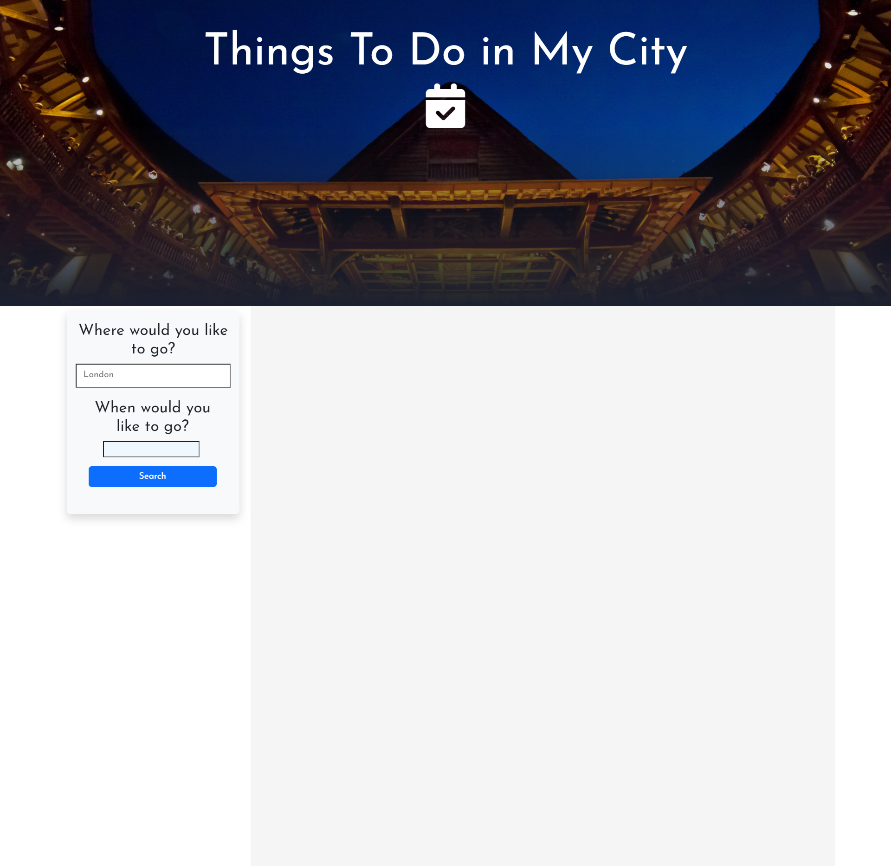
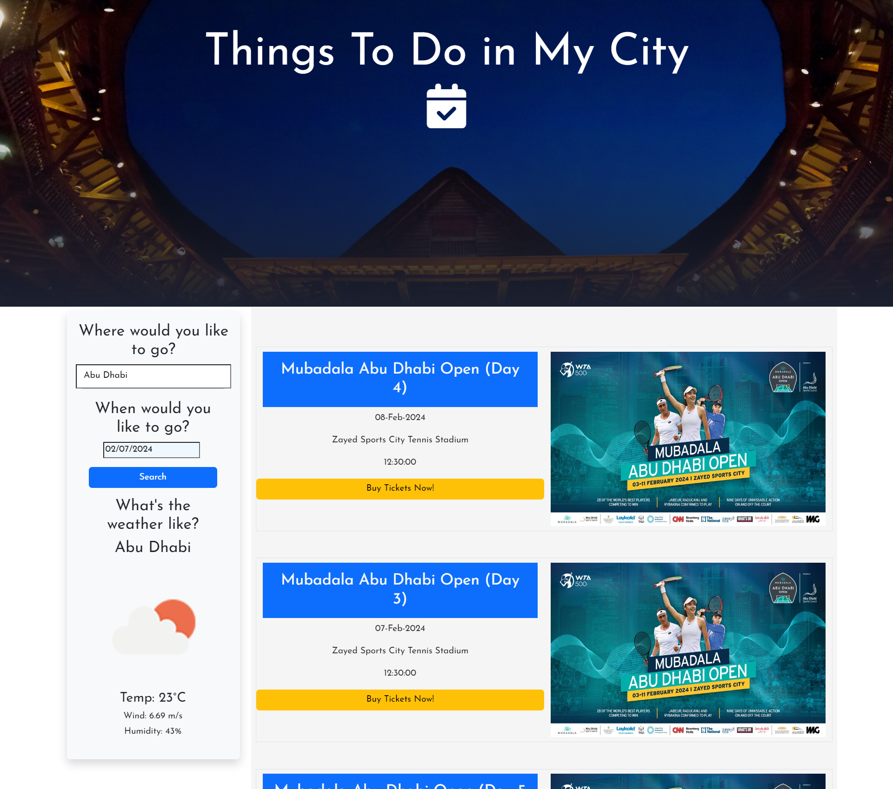
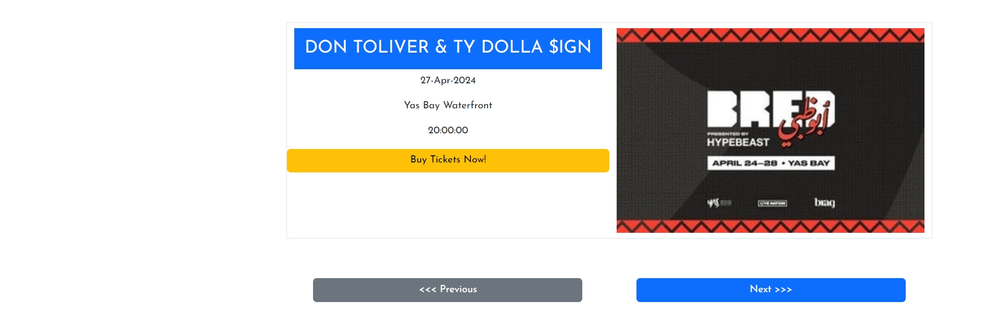

# Things To Do In My City (TTDIMC)
Project 1 edX Bootcamp

## Description

Have you ever travelled to a city and found it difficult to seek activities to do within the city? 

Have you gotten exhausted surfing the internet looking for events happening within the city? 

Well, I have good news because The Things To Do In My City app resolves this problem. It alleviates the burden of spending your free time looking for activities.
Everything has been brought into one place for you, all you need is to type your location and what date you wish to engage in activities. Once you populate the required fields with information, the app shows you all the activities that will be happening in your city within the time period.

Here is a link to the deployed application: https://sarenne89.github.io/TTDIMC/

## Usage

No installation is required. All you need is a device that has access to the internet and with that you can start using our product.

This is how the web page looks like when a user visits for the first time.

md
    

On the right hand side is a search bar. This is the feature that the user is expected to interact with to use the app. It is very easy to use, all the user has to do is type a city name they are interested in seeing events or activities for as well as a date they wish to visit the city and then a request is sent to the API which populates the page with results relating to the search as seen below.

md
    

The image above shows the result returned when a user types a location in the search bar. The app also provides additional features to the user such as the weather information for that city so they can plan accordingly if they wish to go out for any events or activities.

At the bottom of the page are two buttons, previous and next which the user can interact with to generate more events for that specific location.

md
    

    
    

## Credits

This project was carried out by: [Matt Dunmore](https://github.com/sarenne89), [Luke Holliday](https://github.com/thelukass88) and [George Okorie](https://github.com/GiorgioDaVinci).

## License

MIT
